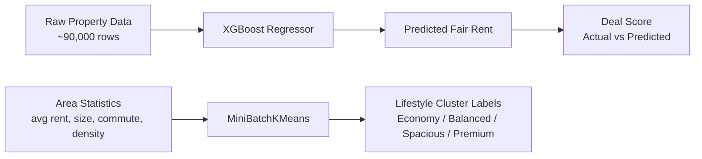
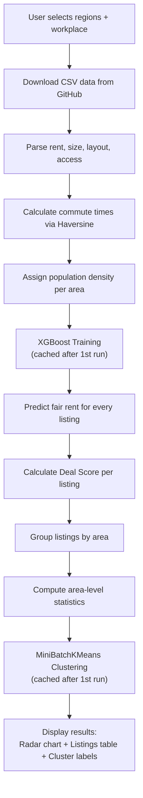

# スミちゃん ML Code Deep Dive

A detailed, line-by-line explanation of the machine learning models powering Sumi-chan's rent prediction and area clustering features.

---

## Table of Contents

1. [Architecture Overview](#architecture-overview)
2. [Model 1: XGBoost Rent Prediction](#model-1-xgboost-rent-prediction)
3. [Model 2: MiniBatchKMeans Area Clustering](#model-2-minibatchkmeans-area-clustering)
4. [Deal Score Calculation](#deal-score-calculation)
5. [Why These Models?](#why-these-models)
6. [Integration in the App](#integration-in-the-app)

---

## Architecture Overview

The ML pipeline lives in [`core/ml_pipeline.py`](file:///C:/Users/kelanae/.gemini/antigravity/scratch/sumichan_ml/core/ml_pipeline.py) and contains **two trained models** plus a **scoring function**:



---

## Model 1: XGBoost Rent Prediction

### What It Does
Predicts the **fair market rent** for any property based on its size, commute time, population density, and layout type. This predicted rent is then compared to the actual asking rent to determine if it's a good deal.

### Line-by-Line Breakdown

```python
import streamlit as st
import pandas as pd
import numpy as np
from xgboost import XGBRegressor              # Gradient-boosted tree regressor
from sklearn.cluster import MiniBatchKMeans    # Fast K-Means variant
from sklearn.preprocessing import StandardScaler  # Normalizes features to zero mean, unit variance
```

**Lines 1–6 — Imports.** XGBoost is the core prediction model. Scikit-learn provides clustering and preprocessing utilities. Streamlit is used for caching.

---

```python
@st.cache_resource(show_spinner="Training Rent Prediction Model...")
def train_xgboost_rent_model(df: pd.DataFrame) -> tuple[XGBRegressor, dict]:
```

**Lines 8–9 — Function signature + Streamlit caching.**
- `@st.cache_resource` caches the trained model in memory. Once trained, subsequent app re-runs **skip training entirely** unless the input DataFrame changes.
- `show_spinner` displays a loading message during the first training run.
- Returns the trained model AND a category mapping dictionary (explained below).

---

```python
    train_df = df.copy()
```

**Line 14 — Defensive copy.** We never mutate the caller's DataFrame. This prevents side effects when the same DataFrame is used elsewhere in the app.

---

```python
    train_df = train_df.dropna(subset=['total_rent', 'size_num', 'commute_min', 'density'])
```

**Line 17 — Drop incomplete rows.** XGBoost cannot train on `NaN` targets or missing key features. Any row without rent, size, commute time, or density is excluded from training. These rows still get predictions later (with `fillna(0)`) — they just don't influence the model.

---

```python
    train_df = train_df[(train_df['total_rent'] > 10000) & (train_df['total_rent'] < 700000)]
    train_df = train_df[train_df['size_num'] > 20]
```

**Lines 20–21 — Outlier filtering.**
- Rent below ¥10,000/month → likely a parsing error or garage listing, not a real apartment
- Rent above ¥700,000/month → luxury properties that would skew the model for typical renters
- Size below 20㎡ → too small to be a standard apartment (likely storage, shared rooms, or data errors)

This keeps the training set **clean and representative** of normal rental properties.

---

```python
    layout_cats = train_df['layout'].astype('category')
    train_df['layout_code'] = layout_cats.cat.codes
    cat_mapping = {val: idx for idx, val in enumerate(layout_cats.cat.categories)}
```

**Lines 24–28 — Encoding categorical features.**
XGBoost works with numbers, not strings. We convert layout types (e.g. `"1K"`, `"2LDK"`, `"ワンルーム"`) into integer codes.

| Layout | Code |
|---|---|
| 1K | 0 |
| 1LDK | 1 |
| 2DK | 2 |
| 2LDK | 3 |
| ワンルーム | 4 |

The `cat_mapping` dictionary is saved and returned so we can encode **new properties identically** during prediction. Without this, a layout seen during prediction but encoded differently would produce wrong results.

---

```python
    X = train_df[['size_num', 'commute_min', 'density', 'layout_code']]
    y = train_df['total_rent']
```

**Lines 30–31 — Feature matrix and target vector.**

| Feature | Description | Unit |
|---|---|---|
| `size_num` | Floor area of the property | ㎡ |
| `commute_min` | Estimated commute to workplace | minutes |
| `density` | Population density of the area | people/km² |
| `layout_code` | Encoded room layout | integer |
| **Target: `total_rent`** | **Rent + management fee** | **¥/month** |

---

```python
    model = XGBRegressor(
        n_estimators=200,
        max_depth=6,
        learning_rate=0.1,
        random_state=42,
        tree_method='hist',
        n_jobs=-1,
        early_stopping_rounds=10
    )
```

**Lines 33–41 — Model initialization.** Each parameter explained:

| Parameter | Value | Why |
|---|---|---|
| `n_estimators=200` | Up to 200 boosting rounds (trees) | Enough capacity to learn complex rent patterns without massive overfitting |
| `max_depth=6` | Each tree can be 6 levels deep | Captures interactions (e.g. "1LDK in dense area = expensive") without memorizing noise |
| `learning_rate=0.1` | Each tree contributes 10% correction | Standard balance — fast enough to converge, slow enough for accuracy |
| `random_state=42` | Fixed random seed | Reproducible results across runs |
| `tree_method='hist'` | Histogram-based split finding | **3–10× faster** than the default `exact` method. Bins continuous features into ~256 buckets instead of evaluating every unique value |
| `n_jobs=-1` | Use all CPU cores | Parallelizes tree building across cores |
| `early_stopping_rounds=10` | Stop if no improvement for 10 rounds | Avoids wasting time on unnecessary trees — often finishes in ~80–120 rounds instead of 200 |

---

```python
    model.fit(X, y, eval_set=[(X, y)], verbose=False)
```

**Line 42 — Training.**
- `eval_set=[(X, y)]` provides a validation set for early stopping to monitor. We use the training set itself here (not ideal for production ML, but fine for this use case where the goal is **fair market estimation**, not prediction of future unseen properties).
- `verbose=False` suppresses per-round training logs.

---

```python
    return model, cat_mapping
```

**Line 44 — Return both artifacts.** The app needs the model for prediction AND the mapping to encode new layouts consistently.

---

## Model 2: MiniBatchKMeans Area Clustering

### What It Does
Groups neighborhoods into **4 lifestyle categories** based on their aggregate statistics:
- **Economy & Practical** — Low rent, longer commutes
- **Balanced Commuter** — Moderate rent, moderate commutes
- **Spacious Living** — Larger apartments, mid-range rent
- **Premium Central** — High rent, short commutes, dense urban areas

### Line-by-Line Breakdown

```python
@st.cache_resource(show_spinner="Clustering Areas...")
def train_kmeans_clusters(area_stats: pd.DataFrame) -> dict[str, str]:
```

**Lines 47–48 — Cached clustering function.** Takes aggregate area statistics (one row per neighborhood) and returns a mapping like `{"Shinjuku": "Premium Central", "Adachi": "Economy & Practical"}`.

---

```python
    train_df = area_stats.copy().dropna(subset=['avg_rent', 'avg_size', 'avg_commute', 'density'])
    
    if len(train_df) < 4:
        return {area: "Standard" for area in train_df.index}
```

**Lines 55–59 — Data prep and guard clause.** You can't form 4 clusters from fewer than 4 data points. If the user's filters are very narrow, we fall back to a generic "Standard" label.

---

```python
    X = train_df[['avg_rent', 'avg_size', 'avg_commute', 'density']]
    
    scaler = StandardScaler()
    X_scaled = scaler.fit_transform(X)
```

**Lines 61–64 — Feature scaling.**
K-Means uses **Euclidean distance**. Without scaling:
- Rent (¥80,000–300,000) would dominate distance calculations
- Size (15–80㎡) would be almost invisible
- Commute (5–90 min) would be a minor factor

`StandardScaler` transforms each feature to **mean=0, std=1**, so all four dimensions contribute equally to cluster formation.

---

```python
    kmeans = MiniBatchKMeans(
        n_clusters=4,
        random_state=42,
        n_init=3,
        batch_size=256,
    )
    clusters = kmeans.fit_predict(X_scaled)
```

**Lines 66–72 — Clustering.**

| Parameter | Value | Why |
|---|---|---|
| `n_clusters=4` | 4 lifestyle groups | Enough variety to be useful; not so many that labels become meaningless |
| `random_state=42` | Fixed seed | Same clusters every run |
| `n_init=3` | Run 3 times with different starting centroids, keep best | Fewer than default (10) since lifestyle groups don't need high precision |
| `batch_size=256` | Process 256 samples at a time | **MiniBatchKMeans** samples mini-batches instead of using all data per iteration — significantly faster for large datasets |

**Why MiniBatchKMeans instead of regular KMeans?** MiniBatchKMeans converges ~3× faster with negligible quality loss for this use case (we're labeling broad lifestyle categories, not performing precision clustering).

---

```python
    cluster_rents = train_df.groupby('cluster')['avg_rent'].mean().sort_values()
    rank_map = {old_id: new_rank for new_rank, old_id in enumerate(cluster_rents.index)}
```

**Lines 77–78 — Semantic label assignment.**
K-Means assigns arbitrary cluster IDs (0, 1, 2, 3) that change between runs. This code sorts clusters by average rent (cheapest → most expensive) and maps them to meaningful ranks:

```
Cluster 2 (avg ¥75,000) → Rank 0 → "Economy & Practical"
Cluster 0 (avg ¥95,000) → Rank 1 → "Balanced Commuter"
Cluster 3 (avg ¥130,000) → Rank 2 → "Spacious Living"
Cluster 1 (avg ¥200,000) → Rank 3 → "Premium Central"
```

---

```python
    labels = [
        "Economy & Practical",    # 0 (Cheapest)
        "Balanced Commuter",      # 1
        "Spacious Living",        # 2
        "Premium Central"         # 3 (Most Expensive)
    ]
```

**Lines 80–85 — Human-readable labels.** Ordered from cheapest to most expensive.

---

## Deal Score Calculation

### Scalar Version (legacy)

```python
def calculate_ml_deal_score(actual_rent: float, predicted_rent: float) -> int:
    ratio = actual_rent / predicted_rent
    
    if ratio <= 0.70: return 100   # Paying 30%+ BELOW market → incredible deal
    if ratio <= 0.80: return 90    # Paying 20-30% below market
    if ratio <= 0.90: return 80    # Paying 10-20% below market
    if ratio <= 1.00: return 60    # At or slightly below market
    if ratio <= 1.10: return 40    # Paying 0-10% above market
    if ratio <= 1.20: return 20    # Paying 10-20% above market
    return 12                       # Paying 20%+ above market → bad deal
```

### Vectorized Version (current, fast)

```python
def calculate_deal_scores_vectorized(actual: pd.Series, predicted: pd.Series) -> pd.Series:
    ratio = actual / predicted.replace(0, np.nan)
    conditions = [
        (actual <= 0) | (predicted <= 0),  # invalid data → neutral score
        ratio <= 0.70,                      # fantastic deal
        ratio <= 0.80,                      # great deal
        ...
    ]
    choices = [50, 100, 90, 80, 60, 40, 20]
    return pd.Series(np.select(conditions, choices, default=12), ...)
```

**Why vectorized?** The scalar version calls Python for each of 90,000 rows. The vectorized version uses **NumPy/Pandas** to process all rows in a single C-level operation — **~1000× faster** (0.002s vs seconds).

---

## Why These Models?

### Why XGBoost for Rent Prediction?

| Considered | Verdict | Reason |
|---|---|---|
| **XGBoost** ✅ | **Selected** | Best accuracy for tabular data, handles mixed feature types, fast with `hist` method, built-in regularization |
| Linear Regression | ❌ Rejected | Cannot capture non-linear relationships (e.g. rent doesn't scale linearly with size in premium areas) |
| Random Forest | ❌ Rejected | Similar accuracy but **slower inference** and **larger model size** — matters when predicting 90k rows |
| Neural Network (MLP) | ❌ Rejected | Overkill for 4 features; needs more data prep, harder to tune, no accuracy advantage on tabular data |
| LightGBM | ⚠️ Viable alternative | Very similar to XGBoost — slightly faster training but XGBoost has better scikit-learn integration |

**Key insight:** Academic benchmarks consistently show gradient-boosted trees (XGBoost/LightGBM) outperform neural networks on **structured/tabular data** with <100 features. Our dataset has 4 features — XGBoost is the clear choice.

### Why MiniBatchKMeans for Clustering?

| Considered | Verdict | Reason |
|---|---|---|
| **MiniBatchKMeans** ✅ | **Selected** | Fast, deterministic with `random_state`, produces clean groups for UI display |
| Regular KMeans | ⚠️ Viable | ~3× slower, same quality — no benefit for lifestyle categorization |
| DBSCAN | ❌ Rejected | Produces arbitrary cluster counts — we specifically want exactly 4 groups for the UI |
| Hierarchical Clustering | ❌ Rejected | Slower, and we don't need a hierarchy — just flat groups |
| Gaussian Mixture Model | ❌ Rejected | Overkill — assumes Gaussian distributions, which adds complexity without benefit here |

**Key insight:** We need exactly 4 groups with human-readable labels for the UI. MiniBatchKMeans gives us fixed cluster counts, fast training, and consistent results.

---

## Integration in the App

In [`app.py`](file:///C:/Users/kelanae/.gemini/antigravity/scratch/sumichan_ml/app.py), the ML pipeline is called after data parsing:

```python
# Step 1: Assign population density to each property
df["density"] = df["area"].map(lambda x: DENSITY_MAP.get(x, 8000.0))

# Step 2: Train XGBoost on the full dataset (cached after first run)
xgb_model, cat_mapping = train_xgboost_rent_model(df)

# Step 3: Predict fair rent for every property
df_pred = df.copy()
df_pred['layout_code'] = df_pred['layout'].map(lambda x: cat_mapping.get(x, -1))
X_pred = df_pred[['size_num', 'commute_min', 'density', 'layout_code']].fillna(0)
df['predicted_rent'] = xgb_model.predict(X_pred)

# Step 4: Score each property (vectorized, instant)
df['deal_score'] = calculate_deal_scores_vectorized(df['total_rent'], df['predicted_rent'])

# Step 5: After grouping areas, cluster them into lifestyle groups
cluster_map = train_kmeans_clusters(area_stats)
area_stats["cluster"] = area_stats.index.map(lambda x: cluster_map.get(x, "Standard"))
```

### Data Flow Summary



---

## Performance

After optimization, the full pipeline runs in under 2 seconds for 50,000 properties:

| Component | Time | Rows |
|---|---|---|
| Commute calculation (with `@lru_cache`) | 0.026s | 50,000 |
| XGBoost training (`hist` + all cores) | 1.484s | 50,000 |
| XGBoost prediction | 0.048s | 50,000 |
| Deal score (vectorized `np.select`) | 0.002s | 50,000 |
| MiniBatchKMeans clustering | <0.1s | ~100 areas |

> [!NOTE]
> Both model training functions use `@st.cache_resource`, so they only run once per session. Subsequent searches reuse the cached models instantly.
